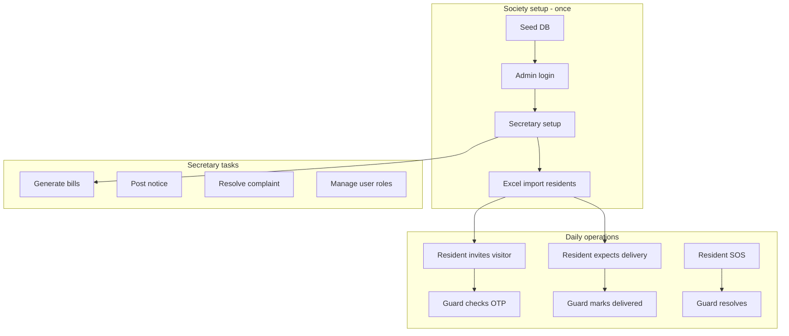

# Marvel Rocks Society — Complete Application Guide

**URL:** http://localhost:3000  
**Society:** Marvel Rocks Society · 90 flats (101–519, duplex 109/110 … 509/510)

This guide walks through the **entire application from the beginning**, with **real examples** you can try on your machine.

---

## Table of contents

1. [How to start the app](#1-how-to-start-the-app)
2. [Phase 1 — First-time Secretary setup](#2-phase-1--first-time-secretary-setup)
3. [Phase 2 — Secretary creates residents](#3-phase-2--secretary-creates-residents)
4. [Phase 3 — Resident uses the app](#4-phase-3--resident-uses-the-app)
5. [Phase 4 — Guard at the gate](#5-phase-4--guard-at-the-gate)
6. [Phase 5 — Committee member](#6-phase-5--committee-member)
7. [Password rules & examples](#7-password-rules--examples)
8. [Screen-by-screen reference](#8-screen-by-screen-reference)
9. [End-to-end example scenarios](#9-end-to-end-example-scenarios)
10. [Known gaps to test](#10-known-gaps-to-test)

---

## 1. How to start the app

**Terminal 1 — API**
```powershell
cd D:\Projects\MyGateSociety\python_app
.\dev.ps1
```

**Terminal 2 — Web UI**
```powershell
cd D:\Projects\MyGateSociety\web
.\dev.ps1
```

Open **http://localhost:3000**

```mermaid
flowchart LR
    A[Home page] --> B[Sign in]
    B --> C{Role?}
    C -->|Secretary| D[/admin]
    C -->|Resident| E[/resident]
    C -->|Guard| F[/security]
    C -->|Committee| D
```

---

## 2. Phase 1 — First-time Secretary setup

### Step 1 — Home page (`/`)

- Title: **Marvel Rocks Society**
- Subtitle: *Society security & community portal*
- Green **Sign in** button
- Service tiles: Visitors, Delivery, Notices, 90 flats, etc.

**Action:** Click **Sign in**

---

### Step 2 — Bootstrap login (only once, fresh database)

After `python -m app.seed --reset`:

| Field | Example value |
|-------|---------------|
| Login ID | `Admin` |
| Password | `admin` |
| Role | Secretary (Main Admin) |

Yellow banner explains this is **one-time only**.

**After setup:** `Admin` will **never work again** — use your mobile number.

---

### Step 3 — First-time setup (`/setup`)

Secretary must enter:

| Field | Example |
|-------|---------|
| Full name | `ATCHYUTARAO` |
| Email | `secretary@email.com` (optional) |
| Mobile (login ID) | `9637945678` |
| Flat | `408` |
| Current password | `admin` (or office default) |
| New password | `Demo@2026` |
| Confirm password | `Demo@2026` |

**Action:** Click **Complete setup & enter app** → redirects to **Admin dashboard**

---

### Step 4 — Admin dashboard (`/admin`)

You will see:

- **Hi {name} · SECRETARY**
- Finance snapshot: Balance, Pending bills
- Quick actions grid:
  - ➕ **Create logins** (Excel or single user)
  - 🏢 All flats (90 homes)
  - 👥 User list (all accounts)
  - 📊 Finance, 🧾 Bills, 🛠️ Helpdesk, 📢 Notices
  - 🚧 Gate console

**Bottom nav:** Home · Finance · Help · More · Gate

---

## 3. Phase 2 — Secretary creates residents

Only **Secretary** (main admin) can create logins.

### Option A — Excel bulk import (recommended for 85+ residents)

**Path:** Admin → **Create logins** → Bulk import

**Excel columns:**

| name | phone | flat | Owner | Tenant | committee_role | email |
|------|-------|------|-------|--------|----------------|-------|
| Rakesh Y | | 101 | Owner | | | |
| Rajendra kumar T | | 102 | | Tenant | | |
| Duplex Owner | 9494974697 / 9493308460 | 109/110 | Owner | | | |

**Rules:**
- Phone **optional** → auto-generated as `88{flat}` (e.g. `8800000101`)
- `109/110` = duplex flat
- Multiple phones: first number used
- Result shows: **X created, Y failed** + password per row

**Example result:**
```
Row 2: Rakesh Y (8800000101) ✓  Password: Marv101 · Flat 101
```

---

### Option B — Single user form

**Path:** Admin → **Create logins** → Single user

| Field | Example |
|-------|---------|
| Name | `Rama Rao` |
| Mobile | `9876543210` |
| Account type | **Owner (in-house)** |
| Flat | `119` |

**Account type options:**

| Selection | Meaning |
|-----------|---------|
| **Owner (in-house)** | Owner living in flat |
| **Resident** → **Owner** | Out-house owner |
| **Resident** → **Tenant** | Tenant (+ owner name & mobile required) |
| **Committee member** | President, Treasurer, Member 1–5, etc. |

**After create:** Credential card appears — copy and WhatsApp to resident:

```
Name: Rama Rao
Mobile: 9876543210
Password: Marv119
Role: RESIDENT
Flat: 119
```

---

### User list — change role / create login

**Path:** Admin → **User list**

Each row shows:
- Name, mobile, flat
- **Account type** dropdown (Resident / Owner / Committee)
- **Owner / Tenant** sub-dropdown (when Resident selected)
- **Tenant owner fields** (when Tenant selected)
- **Change role** — saves without resetting password
- **Create login** — opens form, resets to office password, shows credential card

**Example row:**
```
T.Gopi/ShobhaRani
9618690734 · Flat 519
[Owner (in-house) ▼] [Change role] [Create login]
```

---

## 4. Phase 3 — Resident uses the app

### Step 1 — Resident login

| Field | Example (flat 311) |
|-------|---------------------|
| Mobile | `9700242009` |
| Password | `Marv311` (office default) |
| Role | **Resident** |

First login → **Setup** page → set personal password → **Resident dashboard**

---

### Step 2 — Resident dashboard (`/resident`)

- Greeting + flat number
- Live cards: pending deliveries, unpaid bills, alerts
- Quick links to services

**Bottom nav:** Home · Visitors · Delivery · More

---

### Step 3 — Invite a visitor (`/resident/visitors`)

**Example:**
| Field | Value |
|-------|-------|
| Guest name | `Suresh (cousin)` |
| Purpose | `Family visit` |

**Result:** 6-digit OTP e.g. `482910` — valid today 9:00 AM–9:00 PM

Share OTP with guest → guard enters at gate.

---

### Step 4 — Expect a delivery (`/resident/deliveries`)

**Example:**
| Field | Value |
|-------|-------|
| Company | `Amazon` |
| Description | `Package for flat 311` |
| Instruction | **Allow entry** / Leave at gate / Deny |

**Result:** 6-digit OTP for guard.

---

### Other resident features (More menu)

| Feature | What resident does |
|---------|-------------------|
| **Staff** | Register maid/cook → daily passcode |
| **Vehicles** | Register car/bike plate |
| **Bills** | View & mark maintenance paid |
| **Amenities** | Book clubhouse / pool slot |
| **Polls** | Vote once per poll |
| **Notices** | Read society updates |
| **Complaints** | Raise helpdesk ticket |
| **Kids exit** | Pre-approve child → OTP for guard |
| **SOS** | Raise alarm → guard sees instantly |
| **Directory** | Edit intercom listing |
| **Alerts** | Read notifications |

---

## 5. Phase 4 — Guard at the gate

### Guard login

| Field | Example |
|-------|---------|
| Mobile | `{guard mobile}` |
| Password | `MarvSEC` (office default) |
| Role | **Guard** |

→ Setup → **Gate console** (`/security`)

---

### Gate console — OTP pad

```
┌─────────────────────────────┐
│  Gate — Passcode pad        │
├─────────────────────────────┤
│  Enter 6-digit OTP          │
│  · · · · · ·                │
│  [1] [2] [3]                │
│  [4] [5] [6]                │
│  [7] [8] [9]                │
│  [C] [0] [⌫]                │
└─────────────────────────────┘
```

**When OTP entered:**

| Type | Guard action |
|------|--------------|
| Visitor | **Check in** guest |
| Delivery | **Delivered** or **Left at gate** |
| Staff | **Check in staff** |
| Kid exit | Shows child info (display only) |

**Also on screen:**
- SOS alerts (red banner) → **Resolve**
- Vehicle search (last 4 digits of plate)
- Expected visitors & deliveries list with OTPs

**Example flow:**
```
Resident invites Suresh → OTP 482910
Guard types 482910 → sees "Suresh · Flat 311"
Guard taps Check in → resident gets notification
```

---

## 6. Phase 5 — Committee member

Secretary creates committee login:

| Field | Example |
|-------|---------|
| Account type | Committee member |
| Committee role | President |
| Flat | `205` |
| Password | `MarvPRS` |

**Committee can:**
- View admin dashboard, finance, bills
- Resolve complaints
- Vote in polls

**Committee cannot:**
- Create users / Excel import
- Post notices, record expenses
- Approve move requests

---

## 7. Password rules & examples

Passwords are **hashed in database** — they cannot be read back. Only **reset** via Forgot password.

### Office default passwords

| Role | Formula | Example (flat 408) |
|------|---------|-------------------|
| Resident | `Marv` + flat label | `Marv408` |
| Duplex | `Marv` + label | `Marv109/110` |
| Secretary | `Marv` + `ADM` | `MarvADM` |
| Guard | `Marv` + `SEC` | `MarvSEC` |
| President | `Marv` + `PRS` | `MarvPRS` |
| Treasurer | `Marv` + `TRS` | `MarvTRS` |

### Forgot password (`/forgot-password`)

1. Enter mobile
2. Select role (+ committee role if Committee)
3. Click **Reset to office password**
4. Sign in with shown password → complete setup again

**Example (Secretary):**
- Mobile: `9637945678`
- Role: Secretary (Main Admin)
- New password shown: `MarvADM`

---

## 8. Screen-by-screen reference

### Public screens

| # | Route | Screen | Purpose |
|---|-------|--------|---------|
| 1 | `/` | Home | Landing, link to sign in |
| 2 | `/login` | Sign in | Mobile + password + role |
| 3 | `/forgot-password` | Forgot password | Reset to office default |

### Shared (all roles, after login)

| # | Route | Screen | Purpose |
|---|-------|--------|---------|
| 4 | `/setup` | First-time setup | Profile + new password |
| 5 | `/profile` | My profile | Edit name, directory phone |
| 6 | `/change-password` | Change password | Update personal password |

### Secretary / Committee (`/admin`)

| # | Route | Screen |
|---|-------|--------|
| 7 | `/admin` | Dashboard |
| 8 | `/admin/users` | All accounts (85+) |
| 9 | `/admin/users/new` | Create login + Excel import |
| 10 | `/admin/flats` | 90 flats list |
| 11 | `/admin/bills` | Generate maintenance bills |
| 12 | `/admin/finance` | Ledger + expenses |
| 13 | `/admin/notices` | Post notices |
| 14 | `/admin/complaints` | Helpdesk |
| 15 | `/admin/more` | All modules hub |
| 16 | `/security` | Gate console (Secretary + Guard) |

### Resident (`/resident`)

| # | Route | Screen |
|---|-------|--------|
| 17 | `/resident` | Dashboard |
| 18 | `/resident/visitors` | Invite guests (OTP) |
| 19 | `/resident/deliveries` | Delivery passes |
| 20 | `/resident/notices` | Read notices |
| 21 | `/resident/staff` | Domestic staff |
| 22 | `/resident/bills` | Pay bills |
| 23 | `/resident/sos` | Emergency alarm |
| 24 | `/resident/more` | All resident services |

### Guard (`/security`)

| # | Route | Screen |
|---|-------|--------|
| 25 | `/security` | OTP pad + SOS + vehicles |

---

## 9. End-to-end example scenarios

### Scenario A — New society from scratch

```
1. seed --reset
2. Login Admin / admin / Secretary
3. Setup: mobile 9637945678, flat 408, password Demo@2026
4. Excel import 85 residents
5. Share credential cards via WhatsApp
6. Residents login → setup → use app
```

### Scenario B — Guest visit today

```
1. Resident (flat 311): Visitors → invite "Suresh" → OTP 482910
2. Guest arrives at gate
3. Guard: enter 482910 → Check in
4. Resident gets notification on phone
```

### Scenario C — Amazon delivery

```
1. Resident: Deliveries → Amazon → Allow entry → OTP 739201
2. Guard: 739201 → Delivered
3. Resident notified
```

### Scenario D — Secretary forgot password

```
1. /forgot-password
2. Mobile 9637945678, Role Secretary
3. Reset → MarvADM
4. Login → setup → new password
```

### Scenario E — Promote resident to Committee President

```
1. Admin → User list → find resident
2. Account type → Committee member → President
3. Change role
4. Create login → share new password MarvPRS
```

---

## 10. Known gaps to test

| # | Area | What to verify |
|---|------|----------------|
| 1 | Move requests | Approve button may not show (status mismatch) |
| 2 | Kid exit | Guard sees OTP but cannot confirm exit |
| 3 | Tenant create (UI) | Owner details required on user list |
| 4 | Committee UI | Some create buttons show but API blocks committee |
| 5 | Duplicate phone | Same person as Secretary + Excel import |

---

## Quick test credentials (your database)

| Who | Mobile | Password | Role at login |
|-----|--------|----------|---------------|
| Secretary | `9637945678` | `Demo@2026` (after setup) or `MarvADM` (after reset) | Secretary |
| Resident (flat 311) | `9700242009` | `Marv311` | Resident |
| Resident (flat 519) | `9618690734` | `Marv519` | Resident |

---

## Full journey diagram



---

*Generated for Marvel Rocks Society · MyGateSociety project*  
*Open this file in VS Code or any Markdown viewer alongside http://localhost:3000*
